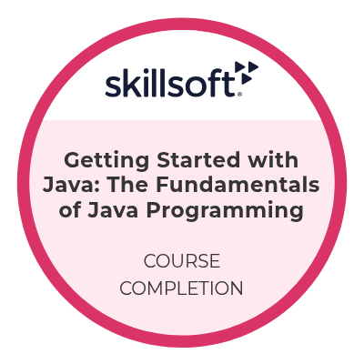
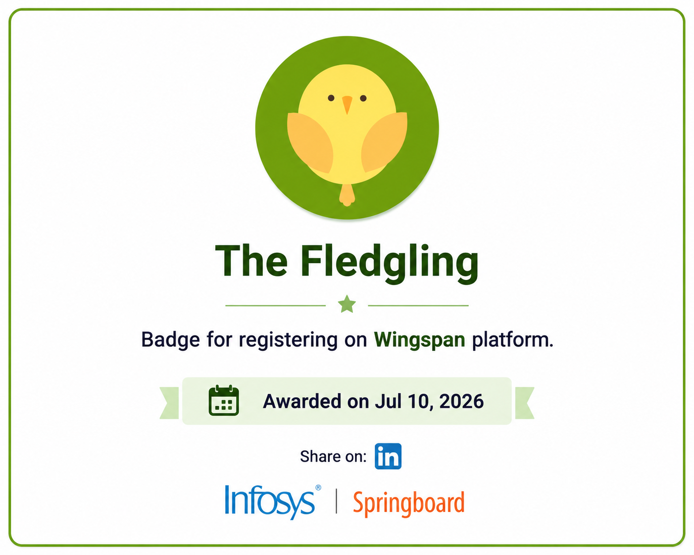
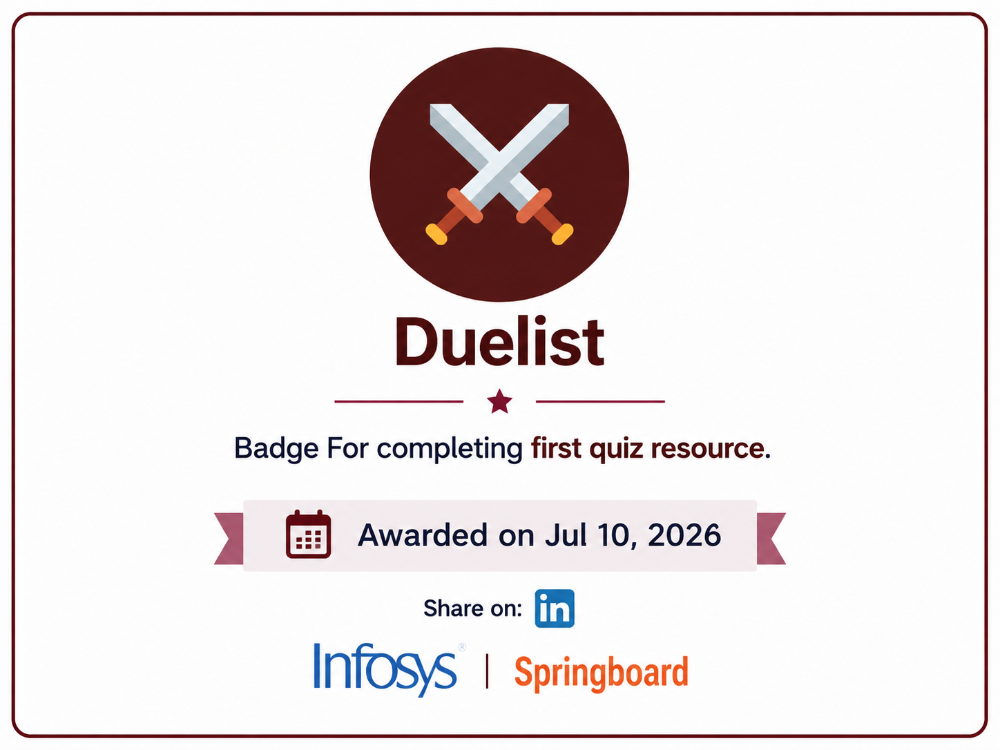
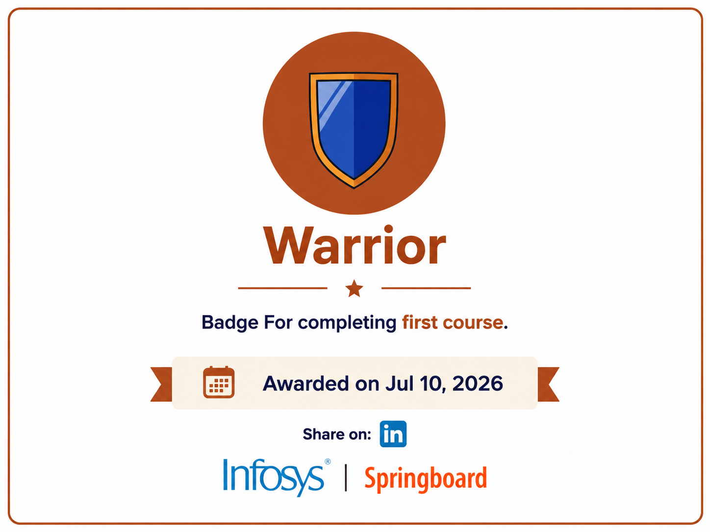
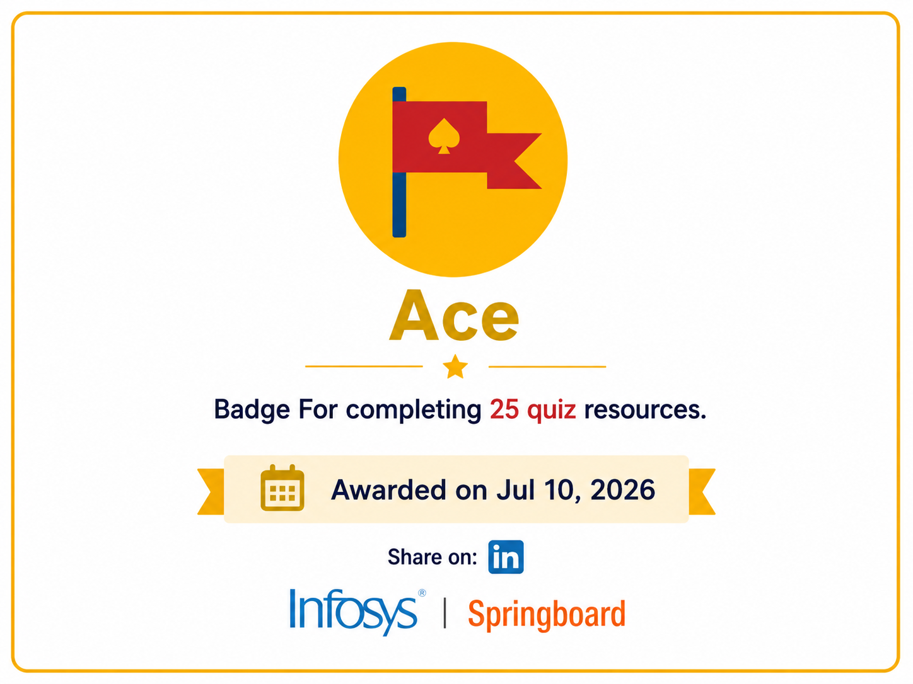
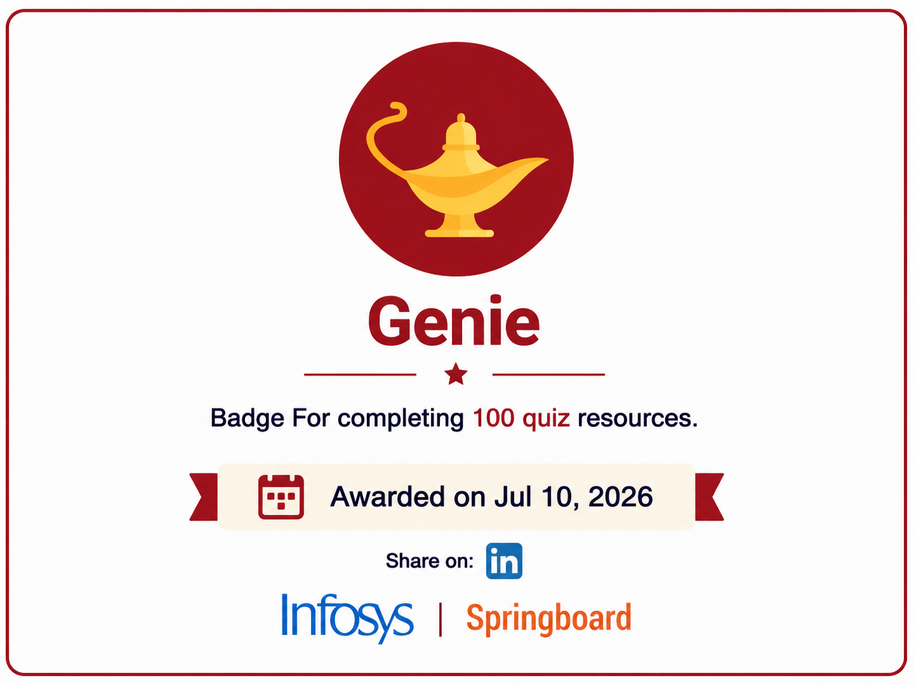
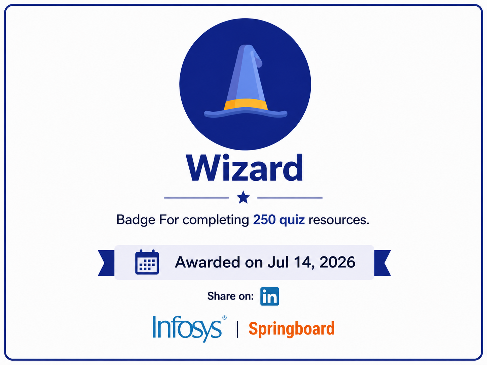

<div align="center">

# 🏆 Professional Certifications

### A Curated Collection of Professional Certifications, Digital Achievement Badges, and Continuous Learning Milestones


### Professional Learning Portfolio

*A comprehensive collection of verified professional certifications, digital achievement badges, and structured technical learning milestones earned through globally recognized learning platforms.*

[](https://github.com/shaikbasha-dev)
[](https://www.linkedin.com/in/shaikbasha-dev/)

</div>

---

# 📖 Repository Overview

Welcome to the **Professional Certifications** repository.

This repository serves as a centralized portfolio of professional certifications, digital achievement badges, and technical learning accomplishments earned through continuous learning and structured technical education.

The certifications and badges included in this repository demonstrate knowledge and practical learning across multiple technology domains, including:

- Java Programming
- Oracle SQL
- HTML5
- CSS3
- JavaScript
- Python
- Database Management Systems
- Web Development
- Software Testing
- Object-Oriented Programming
- Java Full Stack Development

Each certificate validates successful completion of professional learning programs from recognized educational platforms, while the digital badges showcase consistent participation, assessment achievements, and progressive technical learning milestones.

---

# 🎯 Repository Objectives

This repository has been created to:

- Showcase verified professional certifications.
- Maintain a structured technical learning portfolio.
- Demonstrate continuous learning and professional development.
- Highlight programming, database, web development, and software testing skills.
- Build a recruiter-friendly GitHub portfolio.
- Track progress toward becoming a Java Full Stack Developer.

---

# 📊 Repository Statistics

| Category | Details |
|-----------|---------|
| 🎓 Professional Certificates | **12** |
| 🏅 Digital Achievement Badges | **7** |
| 🌐 Learning Platforms | **4** |
| 💻 Programming Languages | **Java, Python, JavaScript, SQL** |
| 🎨 Frontend Technologies | **HTML5, CSS3** |
| 🗄️ Database Technologies | **Oracle SQL** |
| 🧪 Software Testing | **Manual Testing, SDLC, STLC, Test Planning, Defect Life Cycle** |
| 🎯 Career Focus | **Java Full Stack Development** |

---

# 🌐 Learning Platforms

The certifications contained in this repository have been earned through the following professional learning platforms.

| Platform | Description |
|----------|-------------|
| **Infosys Springboard** | Industry-oriented learning platform offering professional technical courses and certifications. |
| **Coursera** | Global online learning platform providing university-recognized courses. |
| **IBM Cognitive Class** | Learning platform focused on databases, cloud computing, artificial intelligence, and software development. |
| **Great Learning** | Professional learning platform offering practical software development and web development courses. |

---

# 🎓 Professional Certifications

The following certifications demonstrate continuous learning across programming languages, databases, web technologies, software testing, and software engineering concepts.

---

## 1️⃣ Programming using Java – Special Batches

| Property | Details |
|----------|---------|
| **Platform** | Infosys Springboard |
| **Course Provider** | Skillsoft |
| **Year** | 2026 |

### Skills Acquired

- Java Programming Fundamentals
- Variables, Identifiers, and Keywords
- Primitive Data Types
- Operators and Expressions
- Type Conversion
- Control Statements
- Looping Statements
- Methods and Constructors
- Object-Oriented Programming
- Encapsulation
- Abstraction
- Access Modifiers
- Arrays and Strings
- Memory Management
- Static Members
- Association and Aggregation
- Inheritance
- Method Overloading
- Method Overriding
- Wrapper Classes
- Abstract Classes
- Interfaces
- Packages
- Exception Handling
- Unit Testing
- Regular Expressions
- Java Collections Framework
- Generics
- ArrayList
- LinkedList
- Set Interface
- HashMap
- Queue Interface

---

## 2️⃣ Getting Started with Java: The Fundamentals of Java Programming

| Property | Details |
|----------|---------|
| **Platform** | Infosys Springboard |
| **Year** | 2026 |
| **Completion Date** | July 11, 2026 |
| **Certificate Issued** | July 12, 2026 |

### Skills Acquired

- Java Programming Fundamentals
- Java Syntax
- Program Structure
- Variables and Data Types
- Operators and Expressions
- Control Flow
- Object-Oriented Programming Fundamentals
- Classes and Objects
- Methods
- Java Development Fundamentals

---

## 3️⃣ HTML5 – The Language

| Property | Details |
|----------|---------|
| **Platform** | Infosys Springboard |
| **Year** | 2026 |
| **Completion Date** | July 14, 2026 |

### Skills Acquired

- HTML5 Fundamentals
- HTML Document Structure
- HTML Elements and Attributes
- Forms and Validation
- Semantic HTML
- Tables and Lists
- Images and Multimedia
- IFrames
- Accessibility
- Web Security Fundamentals

---

## 4️⃣ CSS3

| Property | Details |
|----------|---------|
| **Platform** | Infosys Springboard |
| **Year** | 2026 |
| **Completion Date** | July 14, 2026 |
| **Certificate Issued** | July 15, 2026 |

### Skills Acquired

- CSS Fundamentals
- Selectors
- Colors and Backgrounds
- Typography
- CSS Box Model
- Margin, Border, and Padding
- Positioning
- Flexbox
- CSS Grid
- Responsive Web Design
- Media Queries
- Pseudo-Classes and Pseudo-Elements
- CSS Transitions
- CSS Transformations
- CSS Animations

---

## 5️⃣ Introduction to Oracle: SQL

| Property | Details |
|----------|---------|
| **Platform** | Infosys Springboard |
| **Year** | 2026 |
| **Completion Date** | July 23, 2026 |
| **Certificate Issued** | July 24, 2026 |

### Skills Acquired

- Database Management Systems (DBMS)
- Entity Relationship (ER) Model
- Database Normalization
- Structured Query Language (SQL)
- Restricting and Sorting Data
- Single Row Functions
- Multiple Row Functions
- SQL Joins
- Subqueries
- Data Manipulation Language (DML)
- Data Definition Language (DDL)
- Oracle Date and Time Functions
- Pseudocolumns
- Constraints
- Sequences
- Views
- Indexes
- Controlling User Access
- Synonyms
- Oracle SQL Best Practices

---

## 6️⃣ Fundamentals of Software Testing

| Property | Details |
|----------|---------|
| **Platform** | Infosys Springboard |
| **Year** | 2026 |
| **Completion Date** | August 17, 2026 |
| **Certificate Issued** | August 18, 2026 |

### Skills Acquired

- Fundamentals of Software Testing
- Software Development Life Cycle (SDLC)
- Software Testing Life Cycle (STLC)
- Verification and Validation
- Black Box Testing
- White Box Testing
- Types of System Testing
- Test Planning
- Test Planning Process
- Test Reporting
- Test Metrics
- Defect Life Cycle
- Defect Identification
- Defect Tracking
- Defect Prevention
- Defect Life Cycle Diagram
- Severity and Priority

---

## 7️⃣ Programming for Everybody (Getting Started with Python)

| Property | Details |
|----------|---------|
| **Platform** | Coursera |
| **Year** | 2023 |

### Skills Acquired

- Python Fundamentals
- Variables and Data Types
- Conditional Statements
- Loops
- Functions
- Problem Solving
- Basic Python Programming

---

## 8️⃣ Introduction to Java

| Property | Details |
|----------|---------|
| **Platform** | Coursera |
| **Year** | 2023 |

### Skills Acquired

- Java Fundamentals
- Classes and Objects
- Object-Oriented Programming
- Methods
- Constructors
- Exception Handling Basics

---

## 9️⃣ JavaScript Basics

| Property | Details |
|----------|---------|
| **Platform** | Coursera |
| **Year** | 2022 |

### Skills Acquired

- JavaScript Fundamentals
- Variables
- Data Types
- Operators
- Functions
- DOM Manipulation
- Event Handling

---

## 🔟 SQL and Relational Databases 101

| Property | Details |
|----------|---------|
| **Platform** | IBM Cognitive Class |
| **Year** | 2023 |

### Skills Acquired

- SQL Fundamentals
- Relational Databases
- SQL Queries
- Database Design
- Data Retrieval
- Data Manipulation

---

## 1️⃣1️⃣ Front End Development – HTML

| Property | Details |
|----------|---------|
| **Platform** | Great Learning |
| **Year** | 2024 |

### Skills Acquired

- HTML5 Fundamentals
- HTML Document Structure
- Semantic HTML
- Tables
- Forms
- Hyperlinks
- Images

---

## 1️⃣2️⃣ Front End Development – CSS

| Property | Details |
|----------|---------|
| **Platform** | Great Learning |
| **Year** | 2024 |

### Skills Acquired

- CSS Fundamentals
- CSS Selectors
- Styling Web Pages
- Colors and Fonts
- Flexbox
- Responsive Design
- Layout Techniques

---

# 📋 Certification Summary

| No. | Certification | Platform | Year | Domain |
|:--:|---------------|----------|:---:|--------|
| 1 | Programming using Java – Special Batches | Infosys Springboard | 2026 | Java |
| 2 | Getting Started with Java: The Fundamentals of Java Programming | Infosys Springboard | 2026 | Java |
| 3 | HTML5 – The Language | Infosys Springboard | 2026 | HTML5 |
| 4 | CSS3 | Infosys Springboard | 2026 | CSS3 |
| 5 | Introduction to Oracle: SQL | Infosys Springboard | 2026 | Oracle SQL |
| 6 | Fundamentals of Software Testing | Infosys Springboard | 2026 | Software Testing |
| 7 | Programming for Everybody (Getting Started with Python) | Coursera | 2023 | Python |
| 8 | Introduction to Java | Coursera | 2023 | Java |
| 9 | JavaScript Basics | Coursera | 2022 | JavaScript |
| 10 | SQL and Relational Databases 101 | IBM Cognitive Class | 2023 | SQL |
| 11 | Front End Development – HTML | Great Learning | 2024 | HTML5 |
| 12 | Front End Development – CSS | Great Learning | 2024 | CSS3 |

---

# 🏅 Digital Achievement Badges

In addition to professional certifications, this repository includes digital achievement badges earned through **Infosys Springboard**.

These badges recognize important milestones achieved throughout my learning journey, including platform participation, course completion, quiz completion, and continuous technical skill development.

The badge collection reflects consistent learning, regular assessments, and progressive growth while building expertise in software development and Java Full Stack technologies.

---

## 🥇 Getting Started with Java: The Fundamentals of Java Programming

<div align="center">



</div>

| Property | Details |
|----------|---------|
| **Learning Platform** | Infosys Springboard |
| **Badge Provider** | Skillsoft |
| **Year** | 2026 |
| **Achievement** | Successfully Completed the Course |
| **Focus Area** | Java Programming Fundamentals |

### Badge Overview

This badge recognizes the successful completion of the **Getting Started with Java: The Fundamentals of Java Programming** course. It demonstrates a solid understanding of Java fundamentals, object-oriented programming concepts, and structured software development practices.

---

## 🐣 The Fledgling

<div align="center">



</div>

| Property | Details |
|----------|---------|
| **Learning Platform** | Infosys Springboard |
| **Year** | 2026 |
| **Achievement** | Digital Achievement Badge |
| **Focus Area** | Learning and Platform Participation |

---

## ⚔️ Duelist – First Quiz Resource

<div align="center">



</div>

| Property | Details |
|----------|---------|
| **Learning Platform** | Infosys Springboard |
| **Year** | 2026 |
| **Achievement** | Digital Achievement Badge |
| **Focus Area** | Quiz Participation and Assessment |

---

## 🛡️ Warrior – First Course

<div align="center">



</div>

| Property | Details |
|----------|---------|
| **Learning Platform** | Infosys Springboard |
| **Year** | 2026 |
| **Achievement** | Digital Achievement Badge |
| **Focus Area** | Course Completion |

---

## 🏆 Ace – 25 Quiz Resources

<div align="center">



</div>

| Property | Details |
|----------|---------|
| **Learning Platform** | Infosys Springboard |
| **Year** | 2026 |
| **Achievement** | Digital Achievement Badge |
| **Focus Area** | Quiz-Based Learning and Assessment |

---

## 🧞 Genie – 100 Quiz Resources

<div align="center">



</div>

| Property | Details |
|----------|---------|
| **Learning Platform** | Infosys Springboard |
| **Year** | 2026 |
| **Achievement** | Digital Achievement Badge |
| **Focus Area** | Continuous Assessment and Learning |

---

## 🧙 Wizard – 250 Quiz Resources

<div align="center">



</div>

| Property | Details |
|----------|---------|
| **Learning Platform** | Infosys Springboard |
| **Year** | 2026 |
| **Achievement** | Digital Achievement Badge |
| **Focus Area** | Continuous Quiz-Based Learning |

---

# 💻 Technical Skills

The certifications and digital achievement badges in this repository demonstrate knowledge and structured learning across multiple technologies, programming languages, databases, and software engineering concepts.

## Programming Languages

- Java
- Python
- JavaScript
- SQL

---

## Frontend Technologies

- HTML5
- CSS3
- Responsive Web Design
- Semantic HTML
- CSS Flexbox
- CSS Grid
- CSS Animations

---

## Database Technologies

- Oracle SQL
- Relational Database Management System (RDBMS)
- Database Design
- Entity Relationship (ER) Model
- Database Normalization
- SQL Joins
- Subqueries
- Views
- Indexes
- Constraints
- Sequences

---

## Java Technologies

- Core Java
- Object-Oriented Programming (OOP)
- Exception Handling
- Java Collections Framework
- Generics
- Wrapper Classes
- Interfaces
- Packages
- Arrays
- Strings
- Regular Expressions
- Unit Testing

---

## Software Testing

- Software Testing Fundamentals
- Software Development Life Cycle (SDLC)
- Software Testing Life Cycle (STLC)
- Verification and Validation
- Black Box Testing
- White Box Testing
- System Testing
- Test Planning
- Test Reporting
- Test Metrics
- Defect Life Cycle
- Defect Identification
- Defect Tracking
- Defect Prevention
- Severity and Priority

---

## Software Development Skills

- Problem Solving
- Logical Thinking
- Programming Fundamentals
- Database Design
- Web Development
- Technical Documentation
- Continuous Learning

---

# 🎯 Learning Goal

This repository documents my continuous learning journey through professional certifications, technical courses, and digital achievement badges.

Each certification represents a step toward strengthening my technical foundation in software development while continuously improving my knowledge across Java, databases, web technologies, software testing, and related software engineering domains.

As I continue developing my technical skills, this repository will be updated with additional certifications, learning achievements, and professional milestones.

---

# 📂 Repository Structure

```text
Professional-Certifications/
│
├── Badges/
│   ├── README.md
│   ├── Getting_Started_with_Java_Skillsoft_Badge.png
│   ├── The_Fledgling_Infosys_Springboard_Badge.png
│   ├── Duelist_First_Quiz_Resource_Infosys_Springboard_Badge.png
│   ├── Warrior_First_Course_Infosys_Springboard_Badge.png
│   ├── Ace_25_Quiz_Resources_Infosys_Springboard_Badge.png
│   ├── Genie_100_Quiz_Resources_Infosys_Springboard_Badge.png
│   └── Wizard_250_Quiz_Resources_Infosys_Springboard_Badge.png
│
├── CSS3-Infosys-Springboard-Certificate-2026.pdf
├── Fundamentals-of-Software-Testing-Infosys-Springboard-2026.pdf
├── Front_End_Development_CSS_GreatLearning.pdf
├── Front_End_Development_HTML_GreatLearning.pdf
├── Getting-Started-with-Java-Fundamentals-of-Java-Programming-Infosys-Springboard-2026.pdf
├── HTML5-The-Language-Infosys-Springboard-2026.pdf
├── Introduction-to-Oracle-SQL-Infosys-Springboard-2026.pdf
├── Introduction_to_Java_Coursera.pdf
├── JavaScript_Basics_Coursera.pdf
├── Programming_for_Everybody_Python_Coursera.pdf
├── Programming_using_Java_Infosys_Springboard.pdf
├── SQL_and_Relational_Databases_IBM.pdf
└── README.md
```

# 📦 Repository Contents

This repository currently contains:

- 📜 Professional Certificates
- 🏅 Digital Achievement Badges
- ☕ Java Certifications
- 🗄️ Database and SQL Certifications
- 🌐 Frontend Development Certifications
- 🐍 Python Certification
- 🧪 Software Testing Certification
- 💻 Software Development Learning Resources

The repository is maintained as a structured record of my technical learning, certifications, achievements, and continuous professional development.

---

# 📈 Achievement Progression

The digital achievement badges represent milestones reached throughout my learning journey on the Infosys Springboard platform.

| Badge | Achievement | Milestone |
|-------|-------------|-----------|
| 🐣 **The Fledgling** | Platform Participation | Learning Journey Started |
| ⚔️ **Duelist** | First Quiz Resource | Assessment Journey Began |
| 🛡️ **Warrior** | First Course | First Course Completion |
| 🏆 **Ace** | 25 Quiz Resources | Consistent Learning |
| 🧞 **Genie** | 100 Quiz Resources | Advanced Learning |
| 🧙 **Wizard** | 250 Quiz Resources | Major Learning Milestone |

---

# 🚀 Future Learning Roadmap

This repository will continue to grow as I complete additional certifications, technical courses, and professional learning programs.

Planned learning areas include:

- Spring Framework
- Spring Boot
- Hibernate
- JDBC
- Angular
- TypeScript
- REST APIs
- Git & GitHub
- Docker
- Kubernetes
- AWS Cloud
- DevOps
- Microservices
- System Design

The goal is to continuously strengthen my technical skills and stay aligned with current software industry requirements.

---

---

# 📚 Continuous Learning

Learning does not stop with completing a course or earning a certificate.

I continue to strengthen my technical knowledge through hands-on practice, projects, revision, and exploration of current software development technologies.

This repository will be updated as I progress through new learning milestones and professional certifications.

---

# 🤝 Connect With Me

I am open to opportunities in software engineering and related technical roles.

**Open to Work | Available for Immediate Joining**

Thank you for visiting my certification and learning portfolio.
